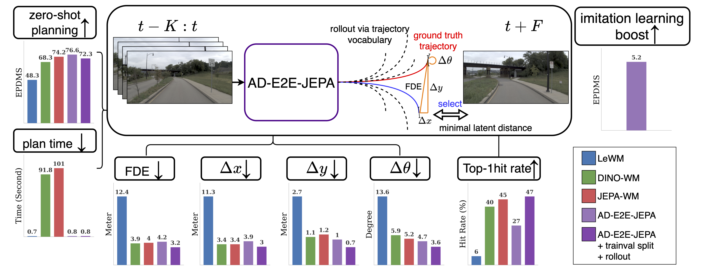

# AD-E2E-JEPA

The official source code for **AD-E2E-JEPA: A Joint-Embedding Predictive Architecture for End-to-End Autonomous Driving** ([arXiv](https://arxiv.org/abs/2609.34085)).

I'm currently preparing the source code for public release and expect to make it available within three weeks, by October 19. Thank you very much for your patience! Please feel free to ping me if it is still not available by then.